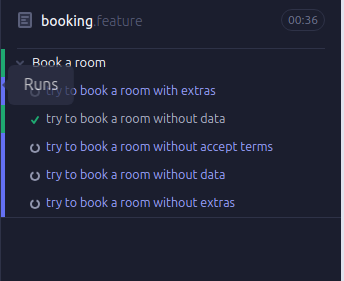
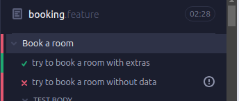
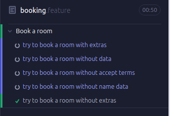
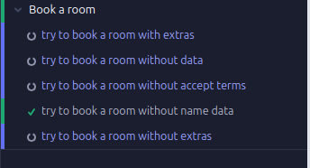
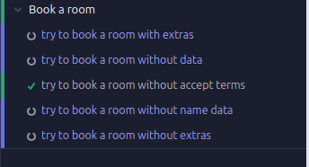
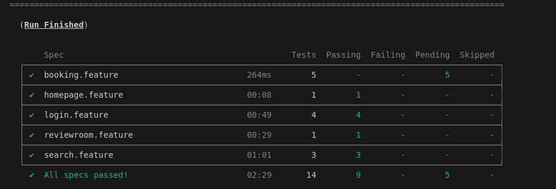

# Testing the Melia Website

The present project tries to implement performance tests on Melias's website.
The test will cover the booking process.

## Sections
1. [Installation](#Installation)
2. [Objective](#Objective)
3. [Code](#Code)
4. [How_to_use](#How_to_use)
5. [Important_information](#Important_information)

## Installation 
The proyect has been run on Ubuntu:
``` bash commands 
npm init -y
npm install cypress --save-dev
npm install --save-dev cypress-cucumber-preprocessor
npm install --save-dev @cucumber/cucumber
npm i -D @types/cucumber @types/chai
npm install cypress-recaptcha --save-dev
npx cypress open
```

## Objective
- Motivation : User wants to book a hotel 
- Acceptance Criteria : 
    1. As a Customer, I want to log in to my account using my username and password.
        1. The system must validate the user and the password.
        2. If a Customer enters the wrong data, a warning will be shown.
    2. As a Customer, I want to search for a hotel room under some preferences
        1. The Customer must be logged in.
        2. The system must validate that the preferences are reachable.
        3. Room options are displayed.
        4. If some data is missing, the system will show a warning.
    3. As a Customer, I want to review the rooms.
        1. The Customer must be logged in, and a search must have occurred.
        2. The website should find some results in that search.
        3. Room information and pictures will be displayed.
    4. As a Customer, I want select a room and make a booking.
        1. The Customer must be logged in, and a search must have occurred.
        2. The system must validate that the preferences are reachable.
        3. The system must validate the personal information.
        4. The system must validate the payment information.
        5. A confirmation text should be sent/ shown.
        6. In case any validation has not been successful, a warning message should be displayed.

## Code
The code is organized into two main folders:
- The features folder contains the test features, which describe the steps that the test will follow using cucumber syntax.
 Here data for the forms would be changed.
- The support folder contains three sub folders:
    1. actions:  this folder contains a file with the shared actions of the test
    2. const: this folder contains the constants used on the test, these will be the files to change if the website changes.
    3. steps: the actual tests.

## How to use

None of the tests are set to run, for doing so, on the .feature files they should be marked as focus.

Once that is done we can execute the chosen test by entering:

``` bash commands

 npx cypress run 

```

The result will be shown on the console. 

## Important information:
For the booking tests, sometime is needed to wait around 10 minutes to performance a second scenario.





